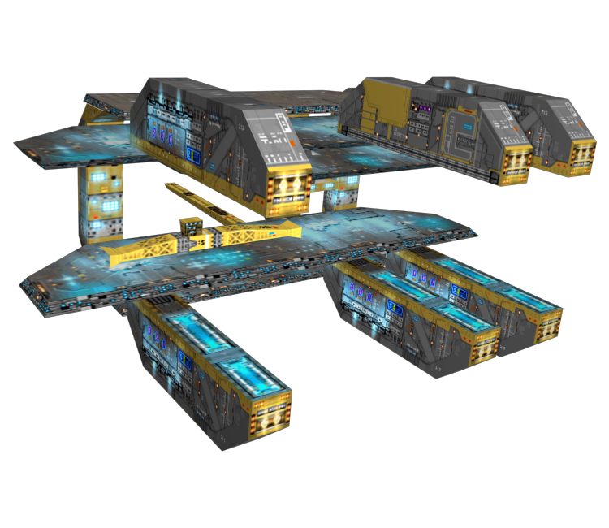

# Scaffold



Scaffold is a tool for developing mods for Homeworld: Remastered. Currently, it will read and write weapon data to and from the `Data/` directory using a `sqlite` database as an intermediary. The tool source itself is fully documented, open source, and is ready to be expanded upon. Pull requests are welcome! Please see `CONTRIBUTING.md` for more details. Please submit any issues through Github as well. 

## Development Setup

1. You'll need a rust tool chain, which you can setup with help from [https://www.rust-lang.org/tools/install](https://www.rust-lang.org/tools/install). 
2. Copy the `.env.example` file to `.env`. 
3. Then run `cargo run -- --db test.sqlite --import-dir <PATH_TO_DATA_DIR>`.
4. Once it finishes, you should have a `test.sqlite` file that you can inspect with any SQL tool that supports sqlite. I recommend [dBeaver](https://dbeaver.io/) or [HeidiSQL](https://www.heidisql.com/).
5. When you're finished with the database, use `cargo run -- --db test.sqlite --export-dir <PATH_TO_DATA_DIR>` to write the files back to the `Data/` directory.

### Documentation

You can automatically generate and display documentation with `cargo doc --open`

### Contributing

See [CONTRIBUTING.md](CONTRIBUTING.md)

## Usage

Scaffold is a command line tool, so you'll need to familize yourself with your platforms' terminal. The tool can be added to your `PATH` or aliased to easily call up from any directory. The tool generates a `sqlite` database that can be used with any number of programs that work with SQL or SQLite directly. See [https://www.sqlite.org/](https://www.sqlite.org/) for more information.

```
Usage: hwrm-scaffold [OPTIONS] --db <DB>

Options:
  -e, --export-dir <EXPORT_DIR>  Path to the Homeworld RM 'data/' directory for export. If both this and `--import-dir` are the same, the import will be performed first
  -i, --import-dir <IMPORT_DIR>  Path to the Homeworld RM 'data/' directory for import. If both this and `--export-dir` are the same, the import will be performed first
  -d, --db <DB>                  Path to Database file; If no directories provided, the database will be migrated only
  -h, --help                     Print help
  -V, --version                  Print version
```

To create or update the database file, you can pass a new file name, or open an existing one. 

```
hwrm-scaffold -d my_mod.sqlite
```

To import a Homeworld Remastered (or Homeworld 2) `Data/` directory:

```
hwrm-scaffold -d my_mod.sqlite -i path/to/my/homeworldrm/data/
```

Scaffold will read the directory and deposit the data it finds into `my_mod.sqlite`. You can then make changes, run queries, create new weapons, etc. When finished, the database can be exported to the same directory:

```
hwrm-scaffold -d my_mod.sqlite -e path/to/my/homeworldrm/data/
```

It is recommended that you keep your mod files in a `git` repository so that you can track the changes you make!

## Depedencies

 - `diesel` - ORM; makes it easy to work with SQL databases. 
    + [https://diesel.rs/](https://diesel.rs/) 
 - `clap` - Handles the Command line interface.
    + [https://docs.rs/clap/latest/clap/](https://docs.rs/clap/latest/clap/)
